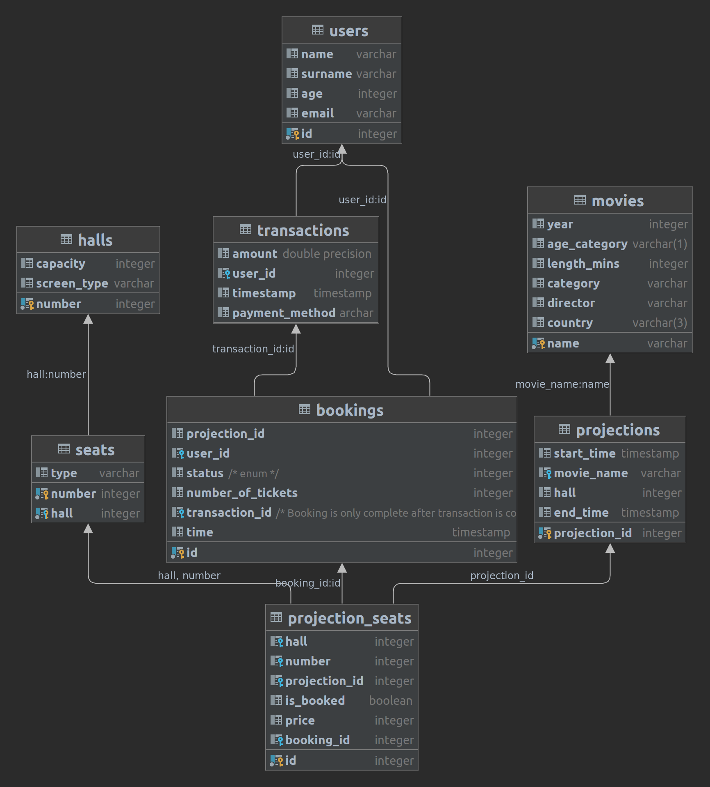

# Database
The database for a small cinema aims at providing a useful yet simple backbone of any application for ticket management of a movie theater built on top of it. 

## Who is this database for?
This database project will be a great starting point for anyone looking into creating their automated system for selling movie theater tickets. If the cinema has more than one locations, it could easily be upgraded into using more than one (which is the current default). Apart from users, wishing to create a full-stack application on top of this database, it could be used by other developers who can base their backend on it, providing a simpler API, which can then be reselled as SaaS.

## How to use this program?
This program is aimed at organizing and facilitating the organization, schedule and sales of a movie theater. Therefore, it could be used by anyone who has a movie theater and wants to optimize their business processes. Such a project also opens the door to online ticket sales, which drives new customers and reduces staff costs, both contributing to higher business profits.

## Functional requirements
This database should be usable for a long period of time, easily maintainable and editable and still be simple enough with no bloat information, which does not affect the end user.

### Requirements:
- All movies should contain information about their name, year of release, age category rating, length in minutes, category, director and country of origin.
- The halls in the theater should be identifiable by their number, but also indicate their capacity and screen type (2D, 3D, IMAX 3D).
- The seats in each halls have numbers and a type.
- Data about the upcoming and passed projections is kept in the projections table which includes the date and time of the projection, end time of projection, movie name which is projected, and the hall in which it is projected.
- As a combination from the previous two, projection-specific data should be kept about all seats. This table should include information about the hall, seat number, projection, status (booked or free), price (because it can vary from hall to hall, movie to movie, date to date, etc.), and a relation to a booking (if the seat is booked, otherwise NULL).
- Information about the users should include name, surname, age, and email.
- All monetary transactions should be also kept in the database as a payment confirmation in order to check for ticket validity (tickets shown at the movie entrance are checked against their transaction id to match different fields). Information about the transaction amount, user who made the transaction, and a timestamp should be kept about all of them.
- Booking data should include the user, status (enum - IN PROGRESS, COMPLETED, REVERTED), number of tickets, transaction info, and a timestamp.
- Users should be able to see all available tickets for a selected projection.
- Users should be able to see all movies which are projected in the next week.

## Non-functional requirements
- To make sure that the tickets sold online or via the theater desk, they would incorporate a qr-code, which will contain information about the successful transaction, making the tickets unique and securing the whole system.
- The system should be able to sustain normal traffic needs (~5000 users browsing for ticket availability at the same time).
- Historical data should be kept for the past 5 years in order to create statistics and improve the business model.
- The system doesn't hold sensitive user information, so there are no high requirements in terms of security. Basic security should provide enough protection against a data breach to competing movie theater companies.

## Schema

## Data restrictions
- The age category for movies is a one letter classification system (A-D).
- The country of origin of movies is kept in a three-letter format (ex. USA, RUS, AUS, etc.)
- Booking status should not fall above the available enum values (0-2) for IN PROGRESS, COMPLETED, REVERTED
- The number of tickets in the bookings table, hall and seat numbers, prices, hall capacities, and user ages should be positive integers.

## Normalization
Our database schema if following all requirements for the 3NF, which is considered a minimum for database designs.

- ### 1NF
  - ✅ ️Each table cell should contain a single value.
  - ✅ ️Each record needs to be unique
- ### 2NF
  - ✅ ️Every non-key attribute is dependent on every key
- ### 3NF
  - ✅ ️Lacks transitive functional dependencies
- ### Boyce Codd normal form (BCNF)
  - Our database does not follow the BCNF normalization form since in the `seats` table we use both the hall and seat number to identify the exact seat. For our example this is perfectly fine, but it could cause problems in other systems.

### What could have been different?
If we used a single table for the both the users and the transactions that they have completed through our service, for example. The schema of the resulting table would look something like this:

Such a schema allows us to make many mistakes such as data duplication, update anomalies, insert anomalies and others.

## Transfer to SQL DDL
The database initialization script can be found [here](./scripts/db_init.sql).

## SQL Queries

