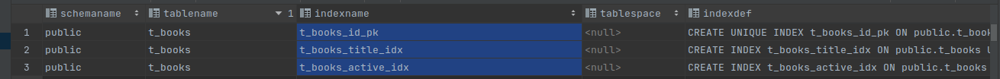
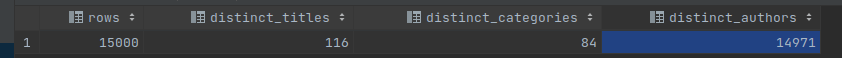

## Tasks  0

The following tasks are part of this hw:

1. ✅ Execute script students/lesson2/0_create_base.sql to create base table and populate it. In this part, I had to rewrite the initial schema script, since it is based on Oracle and I am completing this hw on Postgres. You can check the new initialization script [here](./scripts/create_t_books.sql)
2. ✅ Select from t_books data about book with title 'Oracle Core' and get expected execution plan for this query (in
   Oracle: SET AUTOTRACE ON – SET AUTOTRACE OFF; in postgresql: EXPLAIN). Please, explain the result.
    The sql code for this query is: 

```postgresql
explain select *
from t_books
where title = 'Oracle Core'
```

The result of the query is 
```shell
Seq Scan on t_books  (cost=0.00..432.50 rows=92 width=100) (actual time=3.554..3.556 rows=1 loops=1)
  Filter: ((title)::text = 'Oracle Core'::text)
  Rows Removed by Filter: 14999
Planning Time: 4.850 ms
Execution Time: 3.579 ms
```

`Seq scan on t_books` refers to the fact that the search algorithm for finding the book with title 'Oracle Core' will be a simple sequential scan. The cost of this query (`cost=0.00..432.50`) is actually indicating two things. The first part `0.00` is the so called "Startup cost", while the latter `432.50` is the "Total cost" of the query execution. The unit of measure of the cost values is an arbitrary unit of computation used by the database engine to evaluate the values. The important thing about these values is that they can be compared.

3. ✅ Create B*Tree index with name t_books_title_idx on title column of t_books table, create B*Tree index (
   t_books_active_idx) on is_active column of t_books.
4. ✅ Select index_name, index_type, table_name, uniqueness from pg_indexes view. What is the result? Why?

We can find the new indexes created in the previous exercise.



5. ✅ Gather statistics for t_books table: EXEC DBMS_STATS.GATHER_TABLE_STATS(USER, 't_books', CASCADE => TRUE);
6. ✅ Select from t_books data about book with title 'Oracle Core' and get expected execution plan for this query. Please,
   explain the result.
```shell
Bitmap Heap Scan on t_books  (cost=5.00..186.12 rows=92 width=100) (actual time=0.232..0.236 rows=1 loops=1)
  Recheck Cond: ((title)::text = 'Oracle Core'::text)
  Heap Blocks: exact=1
  ->  Bitmap Index Scan on t_books_title_idx  (cost=0.00..4.97 rows=92 width=0) (actual time=0.225..0.225 rows=1 loops=1)
        Index Cond: ((title)::text = 'Oracle Core'::text)
Planning Time: 0.451 ms
Execution Time: 0.258 ms
```

7. ✅ Select from t_books data about book with book_id = 18 and get expected execution plan for this query. Please, explain
   the result.
```shell
Index Scan using t_books_id_pk on t_books  (cost=0.29..8.30 rows=1 width=100) (actual time=0.454..0.458 rows=1 loops=1)
  Index Cond: (book_id = 18)
Planning Time: 0.486 ms
Execution Time: 0.482 ms
```

We can see that the execution time for both the queries in task 6 and 7 in this case are a lot faster than the initial query in task 2. The newly added indexes managed to decrease the execution time by ~ **10 times**, which can be significant in large scale applications of if queries rely on one another.

8. ✅ Select from t_books data about active books and get expected execution plan for this query. Please, explain the
   result.
```shell
Seq Scan on t_books  (cost=0.00..432.50 rows=7502 width=100) (actual time=0.012..9.711 rows=7502 loops=1)
  Filter: ((is_active)::text = 'Y'::text)
  Rows Removed by Filter: 7498
Planning Time: 0.616 ms
Execution Time: 15.399 ms
```

Indexing a row, which contains only two values doesn't yield much positive results. Since it can only classify the rows in two, it still has to go through all of them. It still will work faster than if there was no index however.

9. ✅ Select number of row in table t_books, distinct values on column title, distinct values in column category, distinct
   values in column author.

10. ✅ Drop indexes on title and is_active columns from t_books table.
11. ❓ Based on previous counts try to create an index that satisfies the following predicates and explain your solution,
    please:
    a. b.title = :v1 and b.category = :v2
    b. b.title = :v1
    c. b.category = :v1 and b.author = :v2
    d. b.author = :v1 and b.book_id = :v2
Thus far this has been the most challenging task from this hw. I cannot figure out how to create such an index. If the index is in the form of (a, b, c), Postgres will use it for queries containing 
```postgresql
where a = v1 and b = v2 and c = v3
OR
where a = v1 and b = v2
OR
where a = v1
```

It will not be invoked if the queries are like this:
```postgresql
where b = v2 and c = v3
OR
where c = v3
```

If I only have to create a single index, it would not optimize all of these queries. Let's create and index for the a and b: 
```postgresql
create index if not exists idx_t_books_title_category on t_books
    (title, category);
```
12. ✅ Test your solution. Please, explain the results.
Here we will observe how the newly created index affects our queries.
When searching on all tree of the columns, I expect to receive very low values for speed, since the index is constructed exactly on those columns.
```postgresql
Bitmap Heap Scan on t_books  (cost=4.43..11.92 rows=2 width=100) (actual time=0.028..0.031 rows=1 loops=1)
  Recheck Cond: (((title)::text = 'I''m from the future. I came here in a Time Machine that you invented. Now I need your help to get ba'::text) AND ((category)::text = 'Domainer'::text))
  Heap Blocks: exact=1
  ->  Bitmap Index Scan on idx_t_books_title_category  (cost=0.00..4.43 rows=2 width=0) (actual time=0.022..0.023 rows=1 loops=1)
        Index Cond: (((title)::text = 'I''m from the future. I came here in a Time Machine that you invented. Now I need your help to get ba'::text) AND ((category)::text = 'Domainer'::text))
Planning Time: 0.127 ms
Execution Time: 0.054 ms
```
And the results confirms my expectations. Simiral results are observed when searching by title only.

I expect to receive worse results if I only search by category or by author and book_id, since those are not indexed:

```postgresql
Index Scan using t_books_id_pk on t_books  (cost=0.29..8.30 rows=1 width=100) (actual time=5.385..5.388 rows=1 loops=1)
  Index Cond: (book_id = 9249)
  Filter: ((author)::text = 'Glen Mann'::text)
Planning Time: 0.560 ms
Execution Time: 5.410 ms
```

We can see that the index based on the primary key helps a little in this case, but it is not sufficient to boost our query a lot. Similar to previous tasks, we can observe a 10x boost when adding indexes.
13. ✅ Select from t_books data about book with title starting with 'Relational' (case-insensitive) and get expected
    execution plan for this query. Please, explain the result.
```postgresql
Seq Scan on t_books  (cost=0.00..432.50 rows=5000 width=100) (actual time=0.019..11.311 rows=1 loops=1)
"  Filter: starts_with((title)::text, 'Relational'::text)"
  Rows Removed by Filter: 14999
Planning Time: 0.499 ms
Execution Time: 11.343 ms
```
This results in a very slow query, since it has to check each row for starting with 'Relational' and there is no index on this column.
14. ✅ Create B*Tree index (t_books_up_title_idx) on UPPER(title) expression of t_books table.
15. ✅ Run the query from step 13 with expected execution plan. Please, explain the result.
```postgresql
Seq Scan on t_books  (cost=0.00..432.50 rows=5000 width=100) (actual time=0.007..5.997 rows=1 loops=1)
"  Filter: starts_with((title)::text, 'Relational'::text)"
  Rows Removed by Filter: 14999
Planning Time: 0.863 ms
Execution Time: 6.012 ms
```

We observe a significant decrease in the execution time (around 2x times).
16. ✅ Select from t_books data about book with substring 'Core' (case-insensitive) in title (in any position in title) and
    get expected execution plan for this query. Please, explain the result.
```postgresql
Seq Scan on t_books  (cost=0.00..470.00 rows=5000 width=100) (actual time=2.160..2.160 rows=0 loops=1)
  Filter: (POSITION(('%Core%'::text) IN (title)) > 0)
  Rows Removed by Filter: 15000
Planning Time: 0.388 ms
Execution Time: 2.197 ms
```

The index for title seems to work, despite the fact that it is only for UPPER(title).
17. ✅ Try to drop all indexes in your schema. Please, explain the result.
I cannot drop the t_books_up_title_idx index for some reason.
18. ❓ Create reverse B*Tree index (t_books_rev_title_idx) on title column of t_books table.
    a. Analyze index (EXPLAIN ANALYZE index_name), select height, lf_blks, br_blks, btree_space, opt_cmpr_count,
    opt_cmpr_pctsave from index_stats view. Explain the result.
    b. Compress t_books_rev_title_idx on opt_cmpr_count and analyze index again. Explain the result.
Not applicable to Postgres.
19. ❓ Select from t_books data about book with title 'Oracle Core' and get expected execution plan for this query. Please,
    explain the result.
Cannot complete due to 18.
20. ❓ Select from t_books data about book with title starting with 'Relational' (case-insensitive) and get expected
    execution plan for this query. Please, explain the result. 
Cannot complete due to 18.
21. ✅ Create your own example of descending B*Tree index.