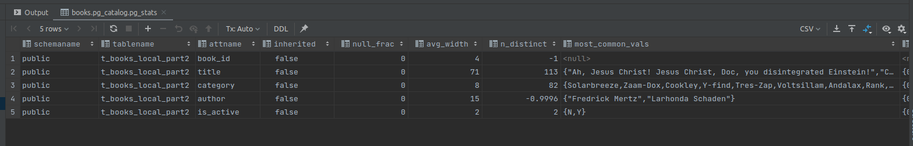

## Tasks  0

The following tasks are part of this hw:

1. ✅ Connect to Oracle instance database under <username> (for example, in sqlplus). 
Change to Postgres.

2. ✅ Execute script students/lesson3/0_create_base.sql to create base table and populate it.
Change script as [follows](./../scripts/create_t_books_part.sql).

3. ✅ Gather statistics for t_books and t_books_part tables
No information is sent from the main t_books table in the pg_stats table.
After gathering the statistics for the different partitions we observe these results:
- Partition 1

- Partition 2

- Partition 3

- Partition 4

4. ✅ Select from t_books_part data about book with book_id = 18 and get expected execution plan for this query. Please, explain the result

```shell
Index Scan using t_books_local_part1_pkey on t_books_local_part1 t_books  (cost=0.29..8.30 rows=1 width=100) (actual time=0.018..0.021 rows=1 loops=1)
  Index Cond: (book_id = 18)
Planning Time: 0.343 ms
Execution Time: 0.040 ms
```

We can see that partitioning the table based on the index gives us quite fast results when querying the db.
5. ✅ Select from t_books_part data about book with title 'Expert Oracle Database Architecture' and get expected execution plan for this query. Please, explain the result

```shell
Append  (cost=0.00..457.47 rows=94 width=108) (actual time=0.706..1.054 rows=1 loops=1)
  ->  Seq Scan on t_books_local_part1 t_books_1  (cost=0.00..289.00 rows=59 width=100) (actual time=0.704..0.705 rows=1 loops=1)
        Filter: ((title)::text = 'Expert Oracle Database Architecture'::text)
        Rows Removed by Filter: 9999
  ->  Seq Scan on t_books_local_part2 t_books_2  (cost=0.00..144.50 rows=33 width=100) (actual time=0.341..0.341 rows=0 loops=1)
        Filter: ((title)::text = 'Expert Oracle Database Architecture'::text)
        Rows Removed by Filter: 5000
  ->  Seq Scan on t_books_local_part3 t_books_3  (cost=0.00..11.75 rows=1 width=526) (actual time=0.002..0.002 rows=0 loops=1)
        Filter: ((title)::text = 'Expert Oracle Database Architecture'::text)
  ->  Seq Scan on t_books_local_part4 t_books_4  (cost=0.00..11.75 rows=1 width=526) (actual time=0.001..0.001 rows=0 loops=1)
        Filter: ((title)::text = 'Expert Oracle Database Architecture'::text)
Planning Time: 1.309 ms
Execution Time: 1.071 msm
```

We can see that the dbms will browse through all the partitions of the tables.
6. ✅ Create local partitioned B*Tree index (t_books_part_local_idx) on title column of t_books_part table.

7. ✅ Run the query from step 5 with expected execution plan. Please, explain the result.
```shell
Append  (cost=4.74..208.82 rows=94 width=108) (actual time=0.191..0.316 rows=1 loops=1)
  ->  Bitmap Heap Scan on t_books_local_part1 t_books_1  (cost=4.74..124.16 rows=59 width=100) (actual time=0.189..0.192 rows=1 loops=1)
        Recheck Cond: ((title)::text = 'Expert Oracle Database Architecture'::text)
        Heap Blocks: exact=1
        ->  Bitmap Index Scan on t_books_local_part1_title_idx  (cost=0.00..4.73 rows=59 width=0) (actual time=0.184..0.184 rows=1 loops=1)
              Index Cond: ((title)::text = 'Expert Oracle Database Architecture'::text)
  ->  Bitmap Heap Scan on t_books_local_part2 t_books_2  (cost=4.54..67.87 rows=33 width=100) (actual time=0.105..0.107 rows=0 loops=1)
        Recheck Cond: ((title)::text = 'Expert Oracle Database Architecture'::text)
        ->  Bitmap Index Scan on t_books_local_part2_title_idx  (cost=0.00..4.53 rows=33 width=0) (actual time=0.103..0.103 rows=0 loops=1)
              Index Cond: ((title)::text = 'Expert Oracle Database Architecture'::text)
  ->  Index Scan using t_books_local_part3_title_idx on t_books_local_part3 t_books_3  (cost=0.14..8.16 rows=1 width=526) (actual time=0.005..0.006 rows=0 loops=1)
        Index Cond: ((title)::text = 'Expert Oracle Database Architecture'::text)
  ->  Index Scan using t_books_local_part4_title_idx on t_books_local_part4 t_books_4  (cost=0.14..8.16 rows=1 width=526) (actual time=0.002..0.003 rows=0 loops=1)
        Index Cond: ((title)::text = 'Expert Oracle Database Architecture'::text)
Planning Time: 2.621 ms
Execution Time: 0.355 ms
```

As expected, the result from the search after adding the title index runs much faster since the search in each partition of the table is `Index scan` instead of a `Seq scan`
8. ✅ Drop index t_books_part_local_idx.

9. ❓ Create global partitioned B*Tree index (t_books_part_global_idx) on title column of t_books_part table. Partitioning scheme - by range with three partitions: first with values less than 'F', second with values less than 'T', third – remaining values.
Postgres partitions are designed in such a way that global partition indexes are not needed. See [this](https://www.postgresql.org/message-id/CALtqXTcurqy1PKXzP9XO=ofLLA5wBSo77BnUnYVEZpmcA3V0ag@mail.gmail.com) material for more information.

    Therefore I will create a normal index for the `t_books` table. 

10. ✅ Run the query from step 5 with expected execution plan. Please, explain the result.

```shell
Append  (cost=4.67..188.24 rows=77 width=526) (actual time=0.436..0.690 rows=1 loops=1)
  ->  Bitmap Heap Scan on t_books_local_part1 t_books_part_1  (cost=4.67..112.93 rows=50 width=526) (actual time=0.433..0.438 rows=1 loops=1)
        Recheck Cond: ((title)::text = 'Expert Oracle Database Architecture'::text)
        Heap Blocks: exact=1
        ->  Bitmap Index Scan on t_books_local_part1_title_idx  (cost=0.00..4.66 rows=50 width=0) (actual time=0.417..0.418 rows=1 loops=1)
              Index Cond: ((title)::text = 'Expert Oracle Database Architecture'::text)
  ->  Bitmap Heap Scan on t_books_local_part2 t_books_part_2  (cost=4.48..58.60 rows=25 width=526) (actual time=0.213..0.215 rows=0 loops=1)
        Recheck Cond: ((title)::text = 'Expert Oracle Database Architecture'::text)
        ->  Bitmap Index Scan on t_books_local_part2_title_idx  (cost=0.00..4.47 rows=25 width=0) (actual time=0.206..0.207 rows=0 loops=1)
              Index Cond: ((title)::text = 'Expert Oracle Database Architecture'::text)
  ->  Index Scan using t_books_local_part3_title_idx on t_books_local_part3 t_books_part_3  (cost=0.14..8.16 rows=1 width=526) (actual time=0.014..0.015 rows=0 loops=1)
        Index Cond: ((title)::text = 'Expert Oracle Database Architecture'::text)
  ->  Index Scan using t_books_local_part4_title_idx on t_books_local_part4 t_books_part_4  (cost=0.14..8.16 rows=1 width=526) (actual time=0.007..0.008 rows=0 loops=1)
        Index Cond: ((title)::text = 'Expert Oracle Database Architecture'::text)
Planning Time: 5.199 ms
Execution Time: 0.859 ms
```
11. ✅ Drop index t_books_part_global_idx.

12. ❓ Create non-partitioned B*Tree index (t_books_part_idx) on book_id column of t_books_part table.

I was not able to find partitioned and non-partitioned indexes in Postgres. Seems like this is a feature of Oracle Databases only. I will create a normal index.
13. ✅ Select from t_books_part data about book with book_id = 11011 and get expected execution plan for this query. Please, explain the result.

```shell
Index Scan using t_books_local_part2_book_id_idx on t_books_local_part2 t_books_part  (cost=0.28..8.30 rows=1 width=100) (actual time=0.197..0.200 rows=1 loops=1)
  Index Cond: (book_id = 11011)
Planning Time: 1.247 ms
Execution Time: 0.221 ms
```

We can see that the database uses our index in order to search for the id. This makes our query faster and more efficient.
14. ✅ Create B*Tree index (t_books_active_idx) on is_active column of t_books table.

15. ❓ Select from t_books data about active books and get expected execution plan for this query. Use hint: /*+ INDEX(table_name_or_alias t_books_active_idx) */. Please, explain the result.

```shell
Append  (cost=0.00..487.35 rows=7504 width=100) (actual time=0.020..8.543 rows=7502 loops=1)
  ->  Seq Scan on t_books_local_part1 t_books_part_1  (cost=0.00..289.00 rows=5002 width=100) (actual time=0.019..3.240 rows=5002 loops=1)
        Filter: ((is_active)::text = 'Y'::text)
        Rows Removed by Filter: 4998
  ->  Seq Scan on t_books_local_part2 t_books_part_2  (cost=0.00..144.50 rows=2500 width=100) (actual time=0.012..1.237 rows=2500 loops=1)
        Filter: ((is_active)::text = 'Y'::text)
        Rows Removed by Filter: 2500
  ->  Index Scan using t_books_local_part3_is_active_idx on t_books_local_part3 t_books_part_3  (cost=0.14..8.16 rows=1 width=526) (actual time=0.009..0.009 rows=0 loops=1)
        Index Cond: ((is_active)::text = 'Y'::text)
  ->  Index Scan using t_books_local_part4_is_active_idx on t_books_local_part4 t_books_part_4  (cost=0.14..8.16 rows=1 width=526) (actual time=0.003..0.003 rows=0 loops=1)
        Index Cond: ((is_active)::text = 'Y'::text)
Planning Time: 9.816 ms
Execution Time: 10.718 ms
```

We observe some strange results here, since in the first two partitions fo the table, the index search is not applied. Instead the dbms searches with a seq scan, making the query slow. It is not clear to me why Postgres doesn't use it. 
16. ✅ Create B*Tree index (t_books_author_title_index) on (author, title) columns of t_books table.

17. ✅ Select max title for every author from t_books table and get expected execution plan for this query. Please, explain the result.

```shell
HashAggregate  (cost=571.60..573.60 rows=200 width=51) (actual time=53.232..69.616 rows=14971 loops=1)
  Group Key: t_books_part.author
  Batches: 1  Memory Usage: 3873kB
  ->  Append  (cost=0.00..495.20 rows=15280 width=93) (actual time=0.012..33.093 rows=15000 loops=1)
        ->  Seq Scan on t_books_local_part1 t_books_part_1  (cost=0.00..264.00 rows=10000 width=86) (actual time=0.010..8.371 rows=10000 loops=1)
        ->  Seq Scan on t_books_local_part2 t_books_part_2  (cost=0.00..132.00 rows=5000 width=86) (actual time=0.010..4.598 rows=5000 loops=1)
        ->  Seq Scan on t_books_local_part3 t_books_part_3  (cost=0.00..11.40 rows=140 width=436) (actual time=0.007..0.008 rows=0 loops=1)
        ->  Seq Scan on t_books_local_part4 t_books_part_4  (cost=0.00..11.40 rows=140 width=436) (actual time=0.003..0.004 rows=0 loops=1)
Planning Time: 1.447 ms
Execution Time: 81.083 ms
```

18. ✅ Select first 10 authors (unique names) in ascending order from t_books table and get expected execution plan for this query. Please, explain the result.

```shell
Limit  (cost=0.90..73.53 rows=10 width=19) (actual time=0.055..0.149 rows=10 loops=1)
  ->  Group  (cost=0.90..1453.50 rows=200 width=19) (actual time=0.050..0.124 rows=10 loops=1)
        Group Key: t_books_part.author
        ->  Merge Append  (cost=0.90..1415.30 rows=15280 width=19) (actual time=0.047..0.095 rows=10 loops=1)
              Sort Key: t_books_part.author
              ->  Index Only Scan using t_books_local_part1_author_title_idx on t_books_local_part1 t_books_part_1  (cost=0.29..726.28 rows=10000 width=15) (actual time=0.018..0.023 rows=4 loops=1)
                    Heap Fetches: 0
              ->  Index Only Scan using t_books_local_part2_author_title_idx on t_books_local_part2 t_books_part_2  (cost=0.28..367.28 rows=5000 width=15) (actual time=0.010..0.020 rows=7 loops=1)
                    Heap Fetches: 0
              ->  Index Only Scan using t_books_local_part3_author_title_idx on t_books_local_part3 t_books_part_3  (cost=0.14..46.25 rows=140 width=218) (actual time=0.005..0.006 rows=0 loops=1)
                    Heap Fetches: 0
              ->  Index Only Scan using t_books_local_part4_author_title_idx on t_books_local_part4 t_books_part_4  (cost=0.14..46.25 rows=140 width=218) (actual time=0.004..0.005 rows=0 loops=1)
                    Heap Fetches: 0
Planning Time: 1.513 ms
Execution Time: 0.215 ms
```
19. ✅ Select author and title from t_books where author starts with 'T' table. Sort results by author and title. Also get expected execution plan for this query. Please, explain the result.
```shell
Append  (cost=0.00..482.47 rows=5094 width=93) (actual time=0.040..8.765 rows=652 loops=1)
  ->  Seq Scan on t_books_local_part1 t_books_part_1  (cost=0.00..289.00 rows=3333 width=86) (actual time=0.037..5.171 rows=437 loops=1)
"        Filter: starts_with((author)::text, 'T'::text)"
        Rows Removed by Filter: 9563
  ->  Seq Scan on t_books_local_part2 t_books_part_2  (cost=0.00..144.50 rows=1667 width=86) (actual time=0.014..2.516 rows=215 loops=1)
"        Filter: starts_with((author)::text, 'T'::text)"
        Rows Removed by Filter: 4785
  ->  Seq Scan on t_books_local_part3 t_books_part_3  (cost=0.00..11.75 rows=47 width=436) (actual time=0.004..0.005 rows=0 loops=1)
"        Filter: starts_with((author)::text, 'T'::text)"
  ->  Seq Scan on t_books_local_part4 t_books_part_4  (cost=0.00..11.75 rows=47 width=436) (actual time=0.003..0.004 rows=0 loops=1)
"        Filter: starts_with((author)::text, 'T'::text)"
Planning Time: 1.619 ms
Execution Time: 9.330 ms
```
20. ✅ Insert new book into t_books table with book_id = 150001, title 'Cookbook', author - 'Mr. Hide', null category (this book must be active). Commit changes.

21. ✅ Create B*Tree index (t_books_cat_idx) on category column of t_books table.

22. ✅ Select author and title from t_books table where category is null. Also get expected execution plan for this query. Please, explain the result.
```shell
Append  (cost=0.29..32.95 rows=4 width=260) (actual time=0.028..0.047 rows=1 loops=1)
  ->  Index Scan using t_books_local_part1_category_idx on t_books_local_part1 t_books_part_1  (cost=0.29..8.30 rows=1 width=86) (actual time=0.013..0.014 rows=0 loops=1)
        Index Cond: (category IS NULL)
  ->  Index Scan using t_books_local_part2_category_idx on t_books_local_part2 t_books_part_2  (cost=0.28..8.30 rows=1 width=86) (actual time=0.012..0.014 rows=1 loops=1)
        Index Cond: (category IS NULL)
  ->  Index Scan using t_books_local_part3_category_idx on t_books_local_part3 t_books_part_3  (cost=0.14..8.16 rows=1 width=436) (actual time=0.003..0.004 rows=0 loops=1)
        Index Cond: (category IS NULL)
  ->  Index Scan using t_books_local_part4_category_idx on t_books_local_part4 t_books_part_4  (cost=0.14..8.16 rows=1 width=436) (actual time=0.002..0.003 rows=0 loops=1)
        Index Cond: (category IS NULL)
Planning Time: 0.241 ms
Execution Time: 0.082 ms
```
23. ✅ Drop t_books_cat_idx index. Create B*Tree index (t_books_cat_null_idx) on category column of t_books table, this index must hold null values.

24. ✅ Run the query from step 22 with expected execution plan. Please, explain the result.
```shell
Append  (cost=0.00..418.83 rows=4 width=260) (actual time=2.134..3.328 rows=1 loops=1)
  ->  Seq Scan on t_books_local_part1 t_books_part_1  (cost=0.00..264.00 rows=1 width=86) (actual time=2.105..2.106 rows=0 loops=1)
        Filter: (category IS NULL)
        Rows Removed by Filter: 10000
  ->  Seq Scan on t_books_local_part2 t_books_part_2  (cost=0.00..132.01 rows=1 width=86) (actual time=0.024..1.194 rows=1 loops=1)
        Filter: (category IS NULL)
        Rows Removed by Filter: 5000
  ->  Seq Scan on t_books_local_part3 t_books_part_3  (cost=0.00..11.40 rows=1 width=436) (actual time=0.004..0.005 rows=0 loops=1)
        Filter: (category IS NULL)
  ->  Seq Scan on t_books_local_part4 t_books_part_4  (cost=0.00..11.40 rows=1 width=436) (actual time=0.003..0.004 rows=0 loops=1)
        Filter: (category IS NULL)
Planning Time: 2.795 ms
Execution Time: 3.365 ms
```
25. Create your own tables and corresponding indexes to show classic “partial” index in Oracle Database and “Selective Uniqueness” cases.