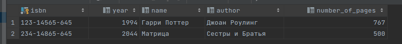
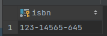
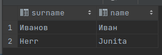
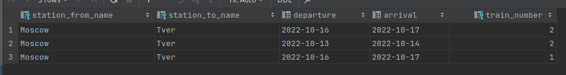

## Task 1
Напишите SQL-запросы для следующих вопросов:

### а) Какие фамилии читателей в Москве? <br>
Запрос:
```
SELECT surname
FROM readers
WHERE address = 'Москва' OR address like '%Moscow%';
```

Результат:  


### б) Какие книги (author, title) брал Иван Иванов? <br>
- Запрос:
```
SELECT *
FROM books
WHERE isbn in (
    SELECT book_isbn
    FROM borrow
    WHERE reader_id = (
        SELECT id
        FROM readers
        WHERE name like 'Иван' AND surname LIKE 'Иванов'
        )
    );
```

- Результат:  


### в) Какие книги (ISBN) из категории "Горы" не относятся к категории "Путешествия"? Подкатегории не обязательно принимать во внимание! <br>
- Запрос:
```
SELECT isbn
FROM books JOIN stores on books.isbn = stores.book_isbn
WHERE category_name = 'Горы' AND isbn NOT IN (
    SELECT isbn
    FROM books JOIN stores on books.isbn = stores.book_isbn
    WHERE category_name = 'Путешествия'
    );


```

- Результат:  


### г) Какие читатели (LastName, FirstName) вернули копию книги? <br>
- Запрос:
```
SELECT r.surname, r.name
FROM borrow b JOIN readers r on b.reader_id = r.id
WHERE b.return_date <= CURRENT_DATE
```

- Результат:  


### д) Какие читатели (LastName, FirstName) брали хотя бы одну книгу (не копию), которую брал также Иван Иванов (не включайте Ивана Иванова в результат)? <br>
- Запрос:
```
SELECT r.surname, r.name
FROM readers r JOIN borrow b on r.id = b.reader_id
WHERE book_isbn IN(
    SELECT book_isbn
    FROM borrow b JOIN readers r on b.reader_id = r.id
    WHERE r.name <> 'Иван' AND r.surname <> 'Иванов'
    INTERSECT
    SELECT book_isbn
    FROM borrow b JOIN readers r on b.reader_id = r.id
    WHERE r.name = 'Иван' AND r.surname = 'Иванов'
    )
```

- Результат:  



## Task 2
### а) Найдите все прямые рейсы из Москвы в Тверь. <br>
- Запрос:
```
SELECT *
FROM connected
WHERE station_from_name = 'Moscow' AND station_to_name = 'Tver'
```

- Результат:  

- 
### б) Найдите все многосегментные маршруты, имеющие точно однодневный трансфер из Москвы в Санкт-Петербург (первое отправление и прибытие в конечную точку должны быть в одну и ту же дату). Вы можете применить функцию DAY () к атрибутам Departure и Arrival, чтобы определить дату. <br>
- Запрос:
```

```

- Результат:  
