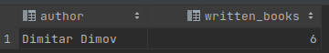
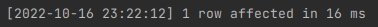
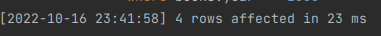

## Task 1
Напишите SQL-запросы для следующих вопросов:

### Показать все названия книг вместе с именами издателей. <br>
Запрос:
```sql
SELECT b.name, p.name
FROM publishes
    join publishers p on p.name = publishes.publisher_name and p.address = publishes.publisher_address
    join books b on b.isbn = publishes.book_isbn
group by b.name, p.name
```

Результат:  


### В какой книге наибольшее количество страниц? <br>
Запрос:
```sql
SELECT name, number_of_pages
from books
where number_of_pages = (
    select max(number_of_pages)
    from books
    )
```

Результат:  


### Какие авторы написали более 5 книг? <br>
Запрос:
```sql
select author, count(*)
from books
group by author
having count(author) > 5
order by count(author) desc
```

Результат:  


### Показать все названия книг вместе с именами издателей. <br>
Запрос:
```sql
SELECT surname
FROM readers
WHERE address = 'Москва' OR address like '%Moscow%';
```

Результат:  


### В каких книгах более чем в два раза больше страниц, чем среднее количество страниц для всех книг? <br>
Запрос:
```sql
select name, number_of_pages
from books
where number_of_pages > 2*(
    select avg(number_of_pages)
    from books
    )
```

Результат:  


### Какие категории содержат подкатегории? <br>
Запрос:
```sql
select category_name
from categories
where category_name in (
    select parent_category
    from categories
    where parent_category is not null
    )
```

Результат:  


### У какого автора (предположим, что имена авторов уникальны) написано максимальное количество книг? <br>
Запрос:
```sql
select author author, count(author) written_books
from books
group by author
having count(author) = (select max(awb.written_books)
                        from (select author author, count(author) written_books
                              from books
                              group by author
                              order by count(author) desc) as awb)
```

Результат:  


###  Какие читатели забронировали все книги (не копии), написанные "Марком Твеном"? <br>
Запрос:
not finished. see [all_mark_twain_books.sql](./queries/all_mark_twain_books.sql)

Результат: null

### Какие книги имеют более одной копии? <br>
Запрос:
db has different schema / not applicable

Результат:  null

###  ТОП 10 самых старых книг <br>
Запрос:
```sql
select name, year
from books
order by year
    fetch first 10 rows only
```

Результат:  


### Перечислите все категории в категории “Спорт” (с любым уровнем вложености). <br>
Запрос:
```sql
update categories
set parent_category = 'Спорт'
```

Результат:  


## Task 2

### Добавьте запись о бронировании читателем ‘Василеем Петровым’ книги с ISBN 123456 и номером копии 4. <br>
Запрос:
```sql
insert into readers (id, surname, name, address, birthday)
values (default, 'Petrov', 'Vasili', 'Moscow', '7-23-1989');

select id
from readers
where name = 'Vasili' and surname = 'Petrov';

insert into books (isbn, year, name, author, number_of_pages)
values ('123456', 2007, 'Just another book', 'James Hyper', 456);

insert into borrow (reader_id, book_isbn, return_date)
values (749, '123456', '8-23-2022');
```

Результат:  


### Удалить все книги, год публикации которых превышает 2000 год. <br>
Запрос:
```
delete from books
where books.year >= 2000
```

Результат:  


### Измените дату возврата для всех книг категории "Базы данных", начиная с 01.01.2016, чтобы они были в заимствовании на 30 дней дольше (предположим, что в SQL можно добавлять числа к датам). <br>
Запрос:
```
TODO
```

Результат: null

## Task 3

Рассмотрим следующую реляционную схему:

* Student( MatrNr, Name, Semester )
* Check( MatrNr, LectNr, ProfNr, Note )
* Lecture( LectNr, Title, Credit, ProfNr )
* Professor( ProfNr, Name, Room )

### Опишите на русском языке результаты следующих запросов:

- 1
```sql
SELECT s.Name, s.MatrNr FROM Student s
WHERE NOT EXISTS (
SELECT * FROM Check c WHERE c.MatrNr = s.MatrNr AND c.Note >= 4.0 ) ;
```
Этот вопрос возращает все студенты, которые имеют оценки только ниже 4.0.

- 2
```sql
( SELECT p.ProfNr, p.Name, sum(lec.Credit)
FROM Professor p, Lecture lec
WHERE p.ProfNr = lec.ProfNr
GROUP BY p.ProfNr, p.Name)
UNION
( SELECT p.ProfNr, p.Name, 0
FROM Professor p
WHERE NOT EXISTS (
SELECT * FROM Lecture lec WHERE lec.ProfNr = p.ProfNr ));
```

Этот вопрос возращает все професоры, которые ведут лекции и общое количество их кредитов. Для всех професоров,
которые не ведут лекции, будет записано 0 как кредитов.

- 3
```sql
SELECT s.Name, p.Note
FROM Student s, Lecture lec, Check c
WHERE s.MatrNr = c.MatrNr AND lec.LectNr = c.LectNr AND c.Note >= 4
AND c.Note >= ALL (
SELECT c1.Note FROM Check c1 WHERE c1.MatrNr = c.MatrNr )
```

Этот вопрос возращает имя студента и его оценка для студетна у которого самая высшая оценка.